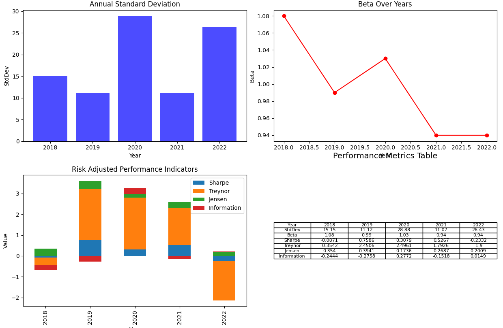

# 投資的回報與風險

當我們投資時，除了關注回報，也需要了解風險。風險調整後的績效指標幫助我們量化投資的風險，並將其與回報相比較。

## 重要的風險調整後績效指標

| 指標          | 定義與評價方法                                | 公式                                                                                          |
|--------------|---------------------------------------------|---------------------------------------------------------------------------------------------|
| **夏普比率 (Sharpe Ratio)** | 衡量每多承擔一單位總風險，能得到多少超額報酬。 | `(Portfolio Return - Risk Free Rate) / Portfolio Standard Deviation`                       |
| **特雷諾比率 (Treynor Ratio)** | 使用Beta來衡量風險，評估每多承擔一單位市場風險，能得到多少超額報酬。 | `(Portfolio Return - Risk Free Rate) / Portfolio Beta`                                    |
| **詹森比率 (Jensen's Alpha)** | 衡量投資組合的實際回報與根據CAPM模型預期的回報之間的差異。 | `Portfolio Return - [Risk Free Rate + Portfolio Beta * (Market Return - Risk Free Rate)]` |
| **資訊比率 (Information Ratio)** | 衡量超過基準的回報與其跟踪誤差的比例。 | `(Portfolio Return - Benchmark Return) / Tracking Error`                                  |
我明白您的觀點。以下我嘗試以更日常的語言來解釋這些衡量風險調整回報的指標：

### 夏普比率（Sharpe Ratio）
夏普比率基本上試圖回答這樣的問題：“我得到的報酬超過無風險投資（例如國債）的部分是否足夠，以彌補我所承受的風險？”高夏普比率可能意味著您的報酬比您所承受的風險更多，這是我們想要的。但它有一個弱點，假設投資回報是常態分佈，但在現實世界中這種情況並不常見。

### 特雷諾比率（Treynor Ratio）
特雷諾比率的關注點是"市場風險"，也就是你不能透過多元化消除的風險。它嘗試回答：“我獲得的每單位市場風險報酬有多少？”高的特雷諾比率意味著你在承受市場風險時獲得了較高的回報。但它的一個弱點是，如果你的投資組合有很多與市場無關的風險，這個指數就可能不準確。

### 詹森比率（Jensen's Alpha）
詹森比率衡量的是你的投資組合相比於市場預期的表現有多好。如果詹森比率是正的，那就意味著你的投資組合超過了市場的預期。但要注意的是，詹森比率假設市場信息是完全透明的，這在現實世界中可能並不準確。

### 資訊比率（Information Ratio）
資訊比率基本上在評估你選擇投資的技巧。它看的是你的投資組合相比於你選擇的基準（比如某種指數）表現有多好。一個高的資訊比率可能意味著你選擇投資的技巧很好。但是，如果没有合适的基准，这个指标可能就无法给出有意义的信息。

希望這對您有所幫助！如果您有任何進一步的問題，請隨時告訴我。

### Beta Over Years (年度Beta值)
Beta衡量的是一個投資和市場整體的關係。當Beta大於1時，它意味著當市場上升時，這個投資可能上升得更多，但當市場下跌時，它也可能下跌得更多。反之，當Beta小於1時，投資的價格波動較市場為小。

### Annual Standard Deviation (年度標準差)
年度標準差幫助我們了解在過去的一年中，投資回報的上下波動是多少。較高的數值意味著較大的波動，而較小的數值則表示較小的波動。

# 結論

這些風險調整後的績效指標為我們提供了一個全面的工具，來比較和評估不同的投資策略。當用正確的方式和背景來解讀時，它們可以幫助投資者做出更明智的投資決策。

